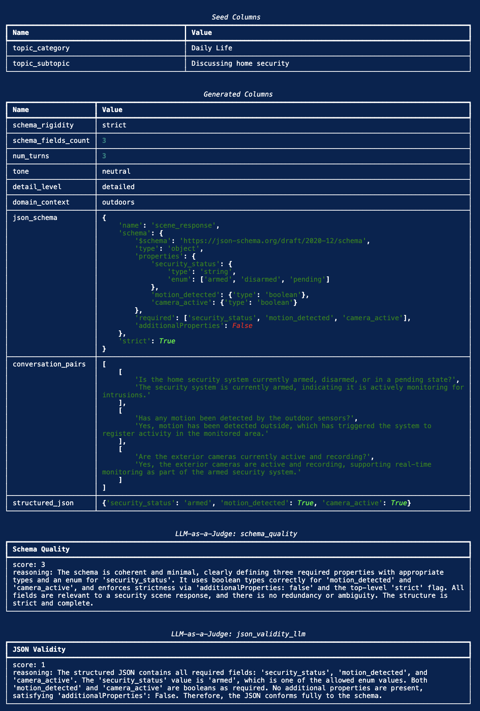

# **Structured Outputs for Nemotron: Teaching Models to Produce Valid JSON, YAML, and XML**

Using [NeMo Data Designer](https://github.com/NVIDIA-NeMo/DataDesigner), an orchestration framework for generating high-quality synthetic data at scale, we built an iterative pipeline that generates diverse, schema-constrained structured outputs across JSON, YAML, and XML. Through multiple rounds of prompt refinement, rejection sampling, and programmatic validation, we produced a 9,949-sample dataset of verified structured output training data.

The dataset is publicly available: **[Download it on HuggingFace](https://huggingface.co/datasets/nvidia/Nemotron-RL-instruction_following-structured_outputs)** (CC BY 4.0).

This post walks through the full SDG pipeline: schema generation, multi-format rollouts, rejection sampling, and the caveats we discovered along the way.

---

## **Why This Matters: Reliably Building Agentic AI Applications**

Every modern AI application that integrates LLMs into a software stack hits the same wall: the model needs to produce *structured* output (JSON, YAML, XML) that downstream code can parse and act on. Function calling, API responses, database inserts, configuration generation, and form filling all require the model to follow a schema precisely.

The stakes are high. When an LLM serves as a backend for tool-calling agents, a single malformed JSON response doesn't just produce a bad answer; it crashes the entire agentic pipeline. The function call fails, the agent can't recover, and the user sees an error. OpenAI, Anthropic, and Google have all invested heavily in structured output guarantees for exactly this reason.

On standard benchmarks, our baseline model failed to produce valid structured outputs up to 35% of the time, depending on schema complexity and format. For an API serving thousands of requests, that's hundreds of failures per hour. Our goal was to reduce this as much as possible through targeted synthetic data.

---

## **Impact on Model Performance**

Training Nemotron Nano v3 with this data improved JSONSchemaBench accuracy from 80.2% to 86.9% and StructEval-Text from 64.5% to 72.1% (+7.6pp overall), confirming the data generalizes across formats. We evaluated across two public benchmarks:

[**JSONSchemaBench**](https://github.com/guidance-ai/jsonschemabench) tests conformance to JSON schemas of varying complexity (nesting depth, field count):

| Model | %Valid |
|-------|--------|
| Baseline SFT Model | 80.2% |
| **Nemotron Nano v3 (trained with this data)** | **86.9%** |
| Baseline Qwen3-30B-A3B-Thinking | 92.8% |
| Baseline GPT-OSS-20B | 95.8% |

[**StructEval-Text**](https://github.com/StructEval/StructEval) tests structured output across multiple formats (CSV, JSON, TOML, XML, YAML):

| Model | CSV | JSON | TOML | XML | YAML | **Overall** |
|-------|-----|------|------|-----|------|-------------|
| Baseline SFT | 92.5% | 68.5% | 19.2% | 44.0% | 64.2% | **64.5%** |
| **Nemotron Nano v3** | **99.1%** | **77.3%** | **28.4%** | **49.5%** | **72.2%** | **72.1%** |
| Qwen3-30B-Instruct | 99.9% | 71.5% | 17.0% | 54.8% | 77.4% | 72.6% |
| GPT-OSS-20B | 98.7% | 79.4% | 94.1% | 53.7% | 88.9% | 81.3% |

Key observations:
- **TOML is the hardest format** -- even GPT-OSS-20B only reaches 94%, and smaller models struggle below 30%. Our data improved TOML from 19.2% to 28.4% but there's significant room to grow.
- **CSV is nearly solved** -- all models score above 92%.
- **JSON and YAML benefit most** from our synthetic data, with 8-9 percentage point gains.
- **XML remains stubborn** -- gains were modest (44% to 49.5%), suggesting XML-specific training data may be needed.

---

## **Structured Outputs Pipeline**

### High-Level Architecture

The pipeline generates structured output training data through a multi-stage process, with rejection sampling to select the best of multiple rollouts:

```
                                  STRUCTURED OUTPUTS SDG PIPELINE
                                  ==============================

     ┌─────────────────────────────────────────────────────────────────────────────────────┐
     │                                 STAGE 1: SEED DATA                                  │
     │                                                                                     │
     │   topic_category (10+ categories)    topic_subtopic (20 per category)               │
     │   200+ unique topic pairs across diverse domains                                    │
     └─────────────────────────────────────────┬───────────────────────────────────────────┘
                                               │
                                               ▼
     ┌─────────────────────────────────────────────────────────────────────────────────────┐
     │                             STAGE 2: DIVERSITY CONTROLS                             │
     │                                                                                     │
     │   Schema Controls              Content Controls          Prompt Controls            │
     │   ├─ rigidity: strict/mod      ├─ format: json/yaml/xml  ├─ length: short/med/long  │
     │   ├─ fields: 3 / 4 / 5         ├─ turns: 2 / 3 / 4       ├─ type: imp/interr/decl   │
     │   ├─ complexity: simple/       ├─ tone                   ├─ tone: formal/neutral/…  │
     │   │   moderate/complex         └─ detail_level           ├─ mode: sys/user/both     │
     │   └─ depth: 2-3 / 4-5 / 6-8                              └─ placement: 6 orderings  │
     └─────────────────────────────────────────┬───────────────────────────────────────────┘
                                               │
                                               ▼
     ┌─────────────────────────────────────────────────────────────────────────────────────┐
     │                        STAGE 3: LLM GENERATION (Qwen3-235B)                         │
     │                                                                                     │
     │   structured_schema ────► conversation_pairs ────► document                         │
     │   (unique per record)      (multi-turn Q&A)         (paragraph or bulleted facts)   │
     │                                    │                                                │
     │                                    ▼                                                │
     │                               user_prompt                                           │
     │                          (diverse instructions)                                     │
     │                                    │                                                │
     │                                    ▼                                                │
     │                          ┌────────────────────┐                                     │
     │                          │   3x ROLLOUTS      │                                     │
     │                          │   output_1         │                                     │
     │                          │   output_2         │                                     │
     │                          │   output_3         │                                     │
     │                          └─────────┬──────────┘                                     │
     └────────────────────────────────────┬────────────────────────────────────────────────┘
                                          │
                                          ▼
     ┌─────────────────────────────────────────────────────────────────────────────────────┐
     │                     STAGE 4: VALIDATION + REJECTION SAMPLING                        │
     │                                                                                     │
     │   For each rollout:                                                                 │
     │     1. Parse check (json.loads / yaml.safe_load / xml.etree)                        │
     │     2. Schema conformance (jsonschema Draft202012Validator)                         │
     │     3. Diagnostic: valid / parse_error / schema_violation                           │
     │                                                                                     │
     │   Pick best valid rollout ────► fallback: parse + length heuristic                  │
     └─────────────────────────────────────────┬───────────────────────────────────────────┘
                                               │
                                               ▼
     ┌─────────────────────────────────────────────────────────────────────────────────────┐
     │                              OUTPUT: SFT / RLVR DATA                                │
     │                                                                                     │
     │   messages: [{system}, {user: prompt + schema + doc}, {assistant}]                  │
     │   9,949 samples  ·  JSON format  ·  CC BY 4.0                                       │
     └─────────────────────────────────────────────────────────────────────────────────────┘
```

### What Makes This Pipeline Different

A simple "generate JSON from a prompt" approach won't cut it. This pipeline has several distinctive design choices:

1. **Per-record schema generation.** Every training example gets a *unique* schema. The model doesn't memorize a handful of fixed structures; it learns to follow arbitrary schemas.

2. **Multi-format support.** The same pipeline produces JSON, YAML, and XML training data by controlling the `output_format` sampler. Schemas are generated natively in the target format, then normalized to JSON Schema for validation.

3. **Depth and complexity control.** Three complexity tiers (`simple`/`moderate`/`complex`) target different nesting depths (2-3, 4-5, 6-8 levels deep). Complex schemas aim for 7-10 levels of nesting when feasible.

4. **Rejection sampling with 3 rollouts.** For each record, we generate 3 candidate structured outputs and validate all of them. We pick the best valid one. If none are valid, we fall back to a heuristic ranker (parse success + length).

5. **Prompt diversity as a first-class concern.** The user prompt varies across sentence length, sentence type, tone, prompt mode (system_only/user_only/both), and placement variant (6 orderings of prompt/schema/document).

---

**Step 1: Seed Data and Schema Generation**

We start with 200+ topic pairs spanning Leisure Activities, Daily Life, Social Interactions, Education, Events, Pets, Parenting, Fitness, Arts, Environment, Developer Configs, Business Docs, Media/Feeds, Geospatial, Civic/Alerts, IoT/Telemetry, and ML/AI.

Schema generation is controlled by four samplers:

```python
config.add_column(dd.SamplerColumnConfig(
    name="schema_complexity",
    sampler_type=dd.SamplerType.CATEGORY,
    params=dd.CategorySamplerParams(values=["simple", "moderate", "complex"]),
))

config.add_column(dd.SamplerColumnConfig(
    name="schema_depth_target",
    sampler_type=dd.SamplerType.SUBCATEGORY,
    params=dd.SubcategorySamplerParams(
        category="schema_complexity",
        values={
            "simple":   ["2-3"],
            "moderate": ["4-5"],
            "complex":  ["6-8"],
        },
    ),
))
```

The schema generation prompt instructs the model (Qwen3-235B-A22B) to produce a JSON Schema with the target depth, at least one boolean and one enum property, `additionalProperties: false` at all levels, and a complete `required` list. Each schema is then normalized to JSON Schema draft 2020-12 for validation.

---

**Step 2: Conversation and Document Generation**

From each schema, we generate multi-turn Q&A pairs whose answers naturally contain the data that the schema describes. These conversation pairs are then transformed into a "document" (either a paragraph or a bulleted list of facts, varying by detail level setting). This document provides the grounding context for the structured output generation.

---

**Step 3: Prompt Assembly and Rollouts**

The user prompt is assembled from diverse instruction templates conditioned on length, type, and tone. It always asks for a strictly conforming structured instance in the requested `output_format`. The schema and document are placed in one of 6 ordering variants (`prompt_schema_document`, `schema_document_prompt`, etc.) to prevent the model from relying on positional cues.

We generate 3 rollout completions per record. Each rollout may include `<think>...</think>` reasoning traces, which are stripped before parsing/validation but retained in the final `messages` for reasoning-mode training.

---

**Step 4: Validation and Rejection Sampling**

Each rollout goes through a three-stage validation pipeline:

1. **Parse check**: Can the output be parsed as valid JSON/YAML/XML? (XML parsing includes sanitization for pre-root noise, comments, and bare `&` escaping.)
2. **Schema validation**: Does the parsed output conform to the normalized JSON Schema? Uses `jsonschema.Draft202012Validator`.
3. **Rejection sampling**: Among the 3 rollouts, pick the best valid one. If none pass, fall back to a parse-success + length heuristic.

Each rollout gets a diagnostic: `valid`, `parse_error`, `schema_missing`, `schema_violation`, or `schema_unchecked`.

---

**A Note on `LLMStructuredColumnConfig`**

Data Designer provides `LLMStructuredColumnConfig`, a column type that guarantees the LLM output conforms to a schema by using Pydantic models or JSON Schema as the `output_format`. This is ideal when every record shares the same structure (e.g., a `QAPair` or `ProductInfo` schema). The framework handles prompting, parsing, and retry logic automatically, ensuring zero schema drift.

In our pipeline, however, schemas are *dynamic*: each record has a unique, per-record schema generated by the LLM. Since `LLMStructuredColumnConfig` requires a fixed `output_format` at config time, we use `LLMTextColumnConfig` for the generation step and validate conformance programmatically with `jsonschema.Draft202012Validator`. If your use case has a fixed output schema, `LLMStructuredColumnConfig` is the simpler and more reliable choice.

---

**Sample Record**

Here's what one complete record looks like after running `display_sample_record()` (topic: "Daily Life / Discussing home security", format: JSON, strict schema):


*Screenshot of Data Designer's `display_sample_record()` output showing seed columns, generated samplers, JSON schema, conversation, structured JSON, and both LLM-as-a-Judge scores.*

---

**Published Dataset**

The dataset is publicly available on HuggingFace:

**[nvidia/Nemotron-RL-instruction_following-structured_outputs](https://huggingface.co/datasets/nvidia/Nemotron-RL-instruction_following-structured_outputs)**

| Metric | Value |
|--------|-------|
| Train split | 9,437 samples |
| Validation split | 512 samples |
| Total | 9,949 samples |
| Format | JSON (schema-constrained) |
| Generator model | Qwen3-235B-A22B-Instruct-2507 |
| Rollouts per record | 3 (rejection sampling, best picked) |
| License | CC BY 4.0 |

Each record contains:
- `responses_create_params`: the full prompt (document + schema + instructions) and model response
- `schema_str`: the JSON Schema the output must conform to (118 chars to 8k chars)
- `schema_type`: format type (`json`)
- `schema_fields_count`: number of required top-level fields (varies from 5 to 12+)

The dataset is designed for use with [NeMo Gym](https://github.com/NVIDIA/NeMo-RL) for **Reinforcement Learning from Verifiable Reward (RLVR)**, where schema conformance provides a deterministic, programmatically verifiable reward signal with no LLM judge needed.

---

**Future Work**

- **TOML, XML, and scaling to more formats.** TOML conformance lags significantly; its nuances (inline tables, array of tables, datetime formats) are underrepresented in generator pretraining. XML parsing is fragile due to pre-root noise (comments, processing instructions, stray text). Markdown tables, Protocol Buffers, and SQL DDL are all structured formats that could benefit from this approach.
- **Schema complexity has diminishing returns.** Depth targets of 6-8 push the generator model to its limits. Many "complex" schemas end up with artificial nesting. The sweet spot is 4-5 levels of meaningful nesting.

---

## **Key Takeaways**

1. **Structured output is a learnable skill.** Targeted synthetic data dramatically improves schema conformance. The baseline-to-trained gap proves this is not a fixed model capability.
2. **Per-record schemas are essential.** Models trained on fixed schemas generalize poorly. A unique schema per record was the single most impactful design choice.
3. **Diversity at every level.** Diverse topics, diverse schemas (depth/width/rigidity), diverse formats, diverse prompts. Each dimension independently improves robustness.
4. **Rejection sampling is cheap insurance.** 3x rollouts push per-record validity from ~80% to >95%. The marginal token cost is small compared to the quality gain.
5. **Validation must be programmatic.** LLM judges assess *design quality* but cannot reliably detect *schema violations*. `jsonschema` + format parsers are non-negotiable.
6. **The hardest formats need the most data.** TOML and XML lag behind JSON and YAML. The pipeline makes it easy to oversample hard formats.

## **Try It Yourself**

The demo below generates JSON structured outputs. To extend to YAML or XML, add an `output_format` sampler and reference it in your prompts:

```python
config.add_column(dd.SamplerColumnConfig(
    name="output_format", sampler_type=dd.SamplerType.CATEGORY,
    params=dd.CategorySamplerParams(values=["json", "yaml", "xml"]),
))
```

Then update the structured output prompt to request `{{ output_format }}` and adjust your validation logic to parse each format accordingly (`json.loads`, `yaml.safe_load`, `xml.etree`).

<details markdown>
<summary><strong>Full source: <code>structured_outputs_demo.py</code></strong></summary>

```python
"""Structured Outputs Demo

Generate schema-conforming JSON with per-record schemas, conversations,
LLM judge evaluation, and programmatic validation.

    pip install data-designer pandas jsonschema
    python structured_outputs_demo.py
"""

import json

import pandas as pd

import data_designer.config as dd
from data_designer.interface import DataDesigner

MODEL_ALIAS = "nvidia-text"

# Seed data: 20 topic pairs across 5 categories
topics = {
    "Leisure Activities": ["Planning a weekend activity", "Discussing a recent movie",
                           "Talking about hobbies", "Recommending a video game"],
    "Daily Life": ["Making dinner plans", "Weather conversation",
                   "Morning routines", "Managing schedules"],
    "Education": ["Choosing a college major", "Study techniques",
                  "Learning a new language", "Online courses"],
    "Technology": ["Smartphone features", "Home automation",
                   "Cloud computing basics", "AI assistants"],
    "Health": ["Workout routines", "Healthy eating",
               "Sleep habits", "Stress management"],
}
rows = [{"topic_category": cat, "topic_subtopic": sub}
        for cat, subs in topics.items() for sub in subs]
seed_df = pd.DataFrame(rows)

# Build the pipeline (uses default NVIDIA provider via NVIDIA_API_KEY)
data_designer = DataDesigner()
config = dd.DataDesignerConfigBuilder()

config.with_seed_dataset(
    dd.DataFrameSeedSource(df=seed_df),
    sampling_strategy=dd.SamplingStrategy.SHUFFLE,
)

# Diversity samplers
config.add_column(dd.SamplerColumnConfig(
    name="schema_rigidity", sampler_type=dd.SamplerType.CATEGORY,
    params=dd.CategorySamplerParams(values=["strict", "moderate"]),
))
config.add_column(dd.SamplerColumnConfig(
    name="schema_fields_count", sampler_type=dd.SamplerType.CATEGORY,
    params=dd.CategorySamplerParams(values=["3", "4", "5"]),
))
config.add_column(dd.SamplerColumnConfig(
    name="num_turns", sampler_type=dd.SamplerType.CATEGORY,
    params=dd.CategorySamplerParams(values=["2", "3", "4"]),
))

# LLM columns: schema -> conversation -> structured JSON
config.add_column(dd.LLMTextColumnConfig(
    name="json_schema", model_alias=MODEL_ALIAS,
    prompt=(
        'Design a JSON Schema for a response object named "scene_response".\n'
        "Controls:\n"
        "- Rigidity: {{ schema_rigidity }}\n"
        "- Number of top-level properties: {{ schema_fields_count }}\n"
        "- Topic Category: {{ topic_category }}\n"
        "- Topic Subtopic: {{ topic_subtopic }}\n\n"
        "Requirements:\n"
        '1. Include a "name" field set to "scene_response"\n'
        '2. Include a "schema" field containing a valid JSON Schema (draft 2020-12)\n'
        '3. Set "strict": true\n'
        "4. Use {{ schema_fields_count }} top-level properties\n"
        "5. Include at least one boolean and one enum property\n"
        '6. Set "additionalProperties": false\n\n'
        "Return ONLY the JSON object, no markdown fences."
    ),
))

config.add_column(dd.LLMTextColumnConfig(
    name="conversation", model_alias=MODEL_ALIAS,
    prompt=(
        "Create a {{ num_turns }}-turn Q&A conversation about a scene "
        "related to {{ topic_category }} / {{ topic_subtopic }}.\n"
        "The conversation should naturally lead to information that fits this JSON schema:\n"
        "{{ json_schema }}\n\n"
        "Format each turn as:\nQ: [question]\nA: [answer]"
    ),
))

config.add_column(dd.LLMTextColumnConfig(
    name="structured_json", model_alias=MODEL_ALIAS,
    prompt=(
        "Based on the following conversation and JSON schema, generate a JSON object "
        "that strictly conforms to the schema.\n\n"
        "Conversation:\n{{ conversation }}\n\n"
        "JSON Schema:\n{{ json_schema }}\n\n"
        "Return ONLY the valid JSON object, no explanation."
    ),
))

# LLM judges: schema quality (0-3) + JSON validity (binary)
config.add_column(dd.LLMJudgeColumnConfig(
    name="quality_score", model_alias=MODEL_ALIAS,
    prompt=(
        "Evaluate the quality of this JSON schema for the topic.\n\n"
        "Schema:\n{{ json_schema }}\n\n"
        "Topic: {{ topic_category }} / {{ topic_subtopic }}"
    ),
    scores=[dd.Score(
        name="schema_quality",
        description="Overall quality of the JSON schema design",
        options={3: "Excellent", 2: "Good", 1: "Fair", 0: "Poor"},
    )],
))

config.add_column(dd.LLMJudgeColumnConfig(
    name="json_validity_llm", model_alias=MODEL_ALIAS,
    prompt=(
        "Does the structured JSON conform to the schema?\n\n"
        "JSON Schema:\n{{ json_schema }}\n\n"
        "Structured JSON:\n{{ structured_json }}"
    ),
    scores=[dd.Score(
        name="json_validity",
        description="Does the structured JSON conform to the schema?",
        options={1: "Valid", 0: "Invalid"},
    )],
))

# Generate and display
preview = data_designer.preview(config, num_records=10)
preview.display_sample_record()

# Programmatic validation
import jsonschema

df = preview.dataset if hasattr(preview, "dataset") else preview
valid = 0
for _, row in df.iterrows():
    try:
        schema_obj = json.loads(row["json_schema"]) if isinstance(row["json_schema"], str) else row["json_schema"]
        json_obj = json.loads(row["structured_json"]) if isinstance(row["structured_json"], str) else row["structured_json"]
        if "schema" in schema_obj:
            jsonschema.Draft202012Validator(schema_obj["schema"]).validate(json_obj)
        valid += 1
    except Exception as e:
        print(f"  Record failed: {e}")

print(f"\nValidation: {valid}/{len(df)} records pass ({valid/len(df)*100:.0f}%)")
```

</details>

---

**Key Resources:**

- **Dataset (download):** [nvidia/Nemotron-RL-instruction_following-structured_outputs](https://huggingface.co/datasets/nvidia/Nemotron-RL-instruction_following-structured_outputs) (CC BY 4.0)
- **NeMo Data Designer:** [github.com/NVIDIA-NeMo/DataDesigner](https://github.com/NVIDIA-NeMo/DataDesigner)
- **NeMo Gym:** [github.com/NVIDIA/NeMo-RL](https://github.com/NVIDIA/NeMo-RL)
- **Nemotron Nano v3 Technical Report:** [research.nvidia.com](https://research.nvidia.com/labs/nemotron/files/NVIDIA-Nemotron-3-Nano-Technical-Report.pdf) | [arxiv.org/abs/2512.20848](https://arxiv.org/abs/2512.20848)

---
