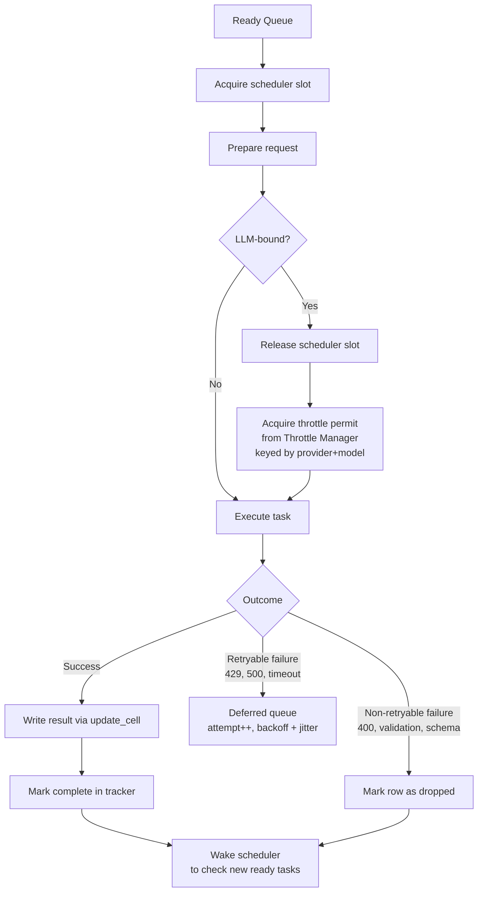
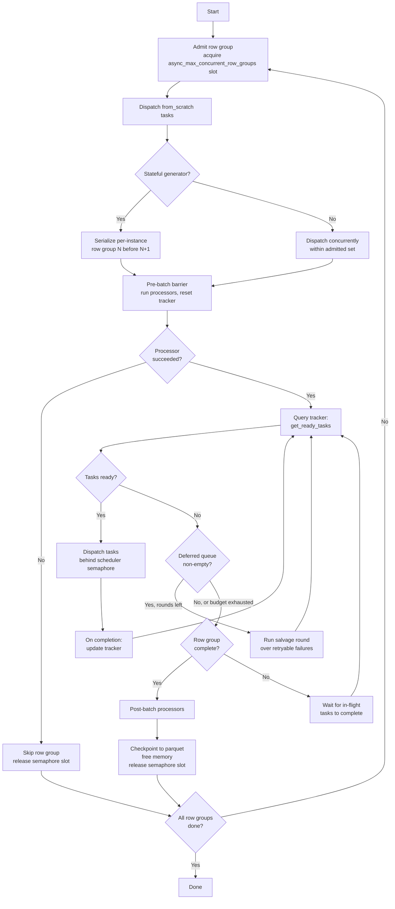
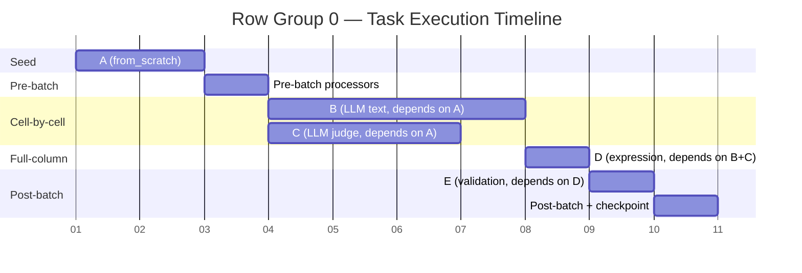
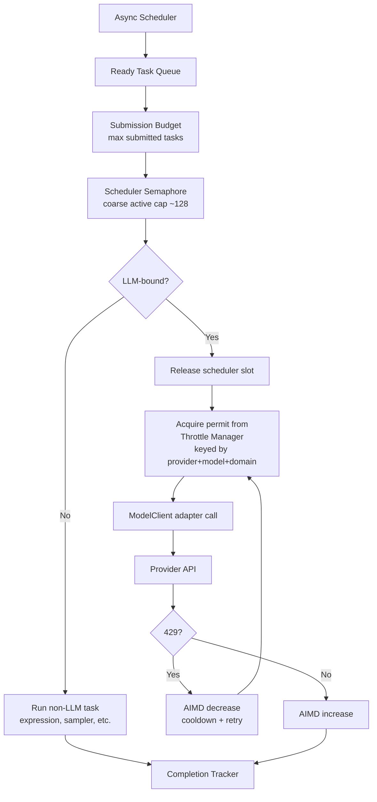
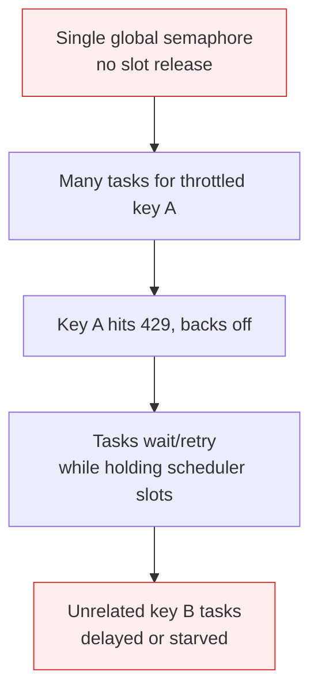
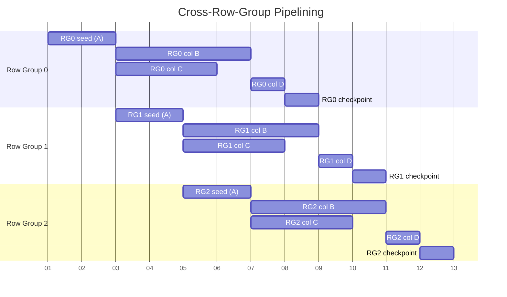

# Async Generators & Task Queue — Reference Diagrams

## 1. Task Lifecycle

How a single task flows through the scheduler, from dispatch to completion or failure.



## 2. Scheduler Main Loop

The overall orchestration flow from start to row group checkpoint.



## 3. Dependency Resolution Example

A concrete pipeline with 5 columns showing parallel execution opportunities.
Columns `B` and `C` are independent and run in parallel once `A` completes.



Dependency map for this example:
```
A: {}              ← no dependencies, from_scratch
B: {A}             ← cell-by-cell, waits for A per row
C: {A}             ← cell-by-cell, waits for A per row (parallel with B)
D: {B, C}          ← full-column, waits for B+C on ALL rows
E: {D}             ← full-column, waits for D
```

## 4. Concurrency Layers

The three-layer design: submission budget (bounded admission), scheduler
semaphore (coarse active-execution guard), and throttle manager (per-key API
concurrency). Tasks release scheduler slots while waiting for throttle permits.



### Failure mode this design avoids

Without slot release, a throttled key starves unrelated keys:



## 5. Row Group Pipelining

Multiple row groups overlap — row group 1 starts its independent columns while
row group 0 is still finishing later columns.



Note: seed (A) is shown staggered because `SeedDatasetColumnGenerator` is
stateful (`is_stateful = True`), so row groups serialize for that generator.
Columns B and C are stateless and pipeline freely across row groups.
